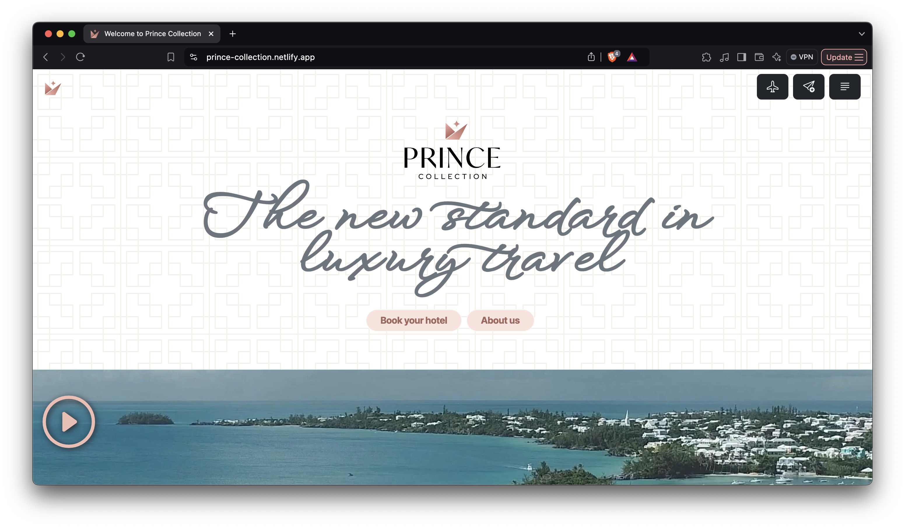

landing page 11-11

# 🚀 Prince Collection 

## Outline

A custom website built for Prince of Travel's luxury travel concierge brand, Prince Collection. The UI design centers on the brand's existing color palette that was expanded for greater variety, cursive and serif fonts for elegance, and combines the refinement of luxury travel websites with the appeal and accessiblity of travel blogs.

## Technologies

The site is built Astro, Vue 3, Bootstrap 5, and AOS for scroll animation. Site blogging functionality uses Decap CMS (formerly Netlify CMS), a node/git-based headless CMS using markdown.

